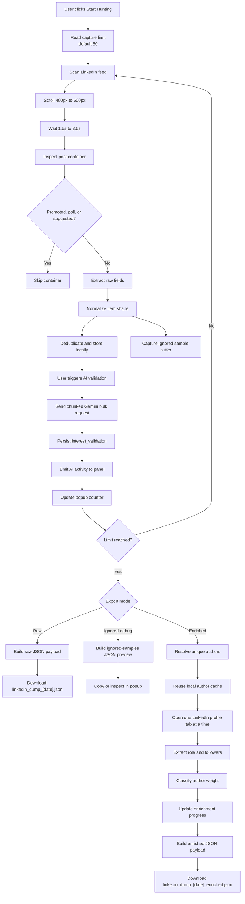

# Collection And Export Flow

## Notes

- Collection should be resumable and should not duplicate previously captured posts.
- Failures in extraction should be observable and should not corrupt stored results.
- Export is local-only in the current phase.
- Enriched export is sequential and exposes explicit post/author progress while the raw batch remains available immediately.
- Non-organic feed items are excluded before they enter normalized storage.
- Gemini validation runs after capture when the user starts it from the popup, uses fixed-size chunks, and may leave posts in `pending` or `unknown` when quota pressure or errors occur.
