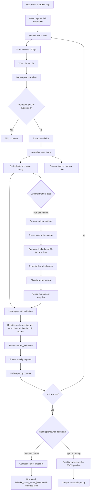

# Collection And Export Flow

## Notes

- Collection should be resumable and should not duplicate previously captured posts.
- Failures in extraction should be observable and should not corrupt stored results.
- Export is local-only in the current phase.
- The LinkedIn panel downloads the latest stable result snapshot and disables download while the crawler, enrichment, or AI validation is running.
- Author enrichment is sequential, preserves partial progress on cancellation, and the latest download composes that snapshot with the latest AI validation overlay.
- Enriched author classification may end in `trivial` when enrichment cannot find followers or a strong enough role signal; `low` is reserved for authors with real but weak follower evidence.
- Non-organic feed items are excluded before they enter normalized storage.
- Gemini validation runs after capture, uses fixed-size chunks, and may leave posts in `pending` or `unknown` when quota pressure or errors occur.
