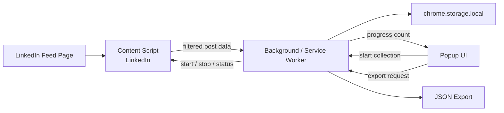

# Extension Architecture

## Notes

- LinkedIn DOM access stays inside the LinkedIn content script layer.
- Background logic coordinates collection state, deduplication, popup status, and export.
- The popup is part of the MVP contract, but it should remain thin.
- Persistence uses `chrome.storage.local` in the current design.
