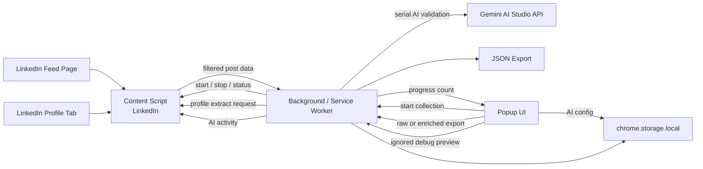

# Extension Architecture

## Notes

- LinkedIn DOM access stays inside the LinkedIn content script layer.
- Background logic coordinates collection state, deduplication, popup status, AI validation, raw export, and sequential enriched export.
- The popup is part of the MVP contract, but it should remain thin.
- Persistence uses `chrome.storage.local` for author cache and lightweight UI preferences, plus tab-scoped session state for active collection data.
- AI validation is configured from the popup and processed conservatively to fit Google AI Studio free-tier limits.
